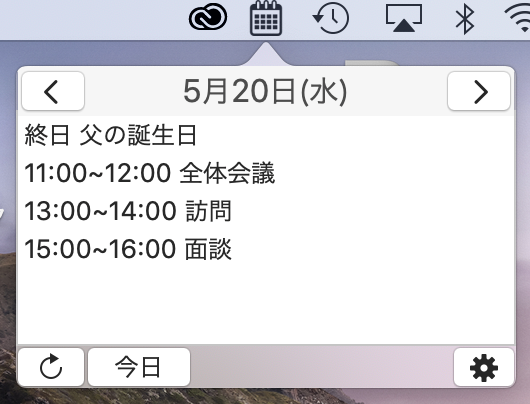

## Waslendar-for-Mac
画面右上のメニューバーにカレンダーのアイコンが表示され、Mac標準カレンダーの予定を簡単に確認できます。
<!--more-->
アイコンを押すだけでスケジュールを確認することができるので、ビデオ会議中に突然「明日の15時から空いてる？」と言われても困ることはありません。

メニューバーに表示する内容は、アイコン、「次の予定まであと何分」、「時計」など色々選べます。

## ダウンロード

`Latest`
### version 1.0.3
macOS 11.0 Big Sur (Developer Beta)で不具合のあった部分を修正しました。
macOS Xでの動作も確認しています。
##### Bug Fixes
- 英語設定の時の不具合を修正
- 一部のボタンのサイズを変更

[**Download**](https://github.com/Luke-1220/Waslendar-for-Mac/releases/download/v1.0.3/Waslendar_ver.1.0.3.zip)

  
<b>Previous versions</b>

  ### version 1.0.2 (Notarized)
  起動時の警告が表示されないようになりました。
  ##### What's New
  - Appleの公証に通過

  [**Download**](https://github.com/Luke-1220/Waslendar-for-Mac/releases/download/v1.0.2n/Waslendar_ver.1.0.2_new.dmg)

  ### version 1.0.2

  ##### What's New
  - ウィンドウのサイズを3段階で調整可能に
  ##### Bug Fixes
  - 次の予定が表示されない不具合を修正

  [**Download**](https://github.com/Luke-1220/Waslendar-for-Mac/releases/download/v1.0.2/Waslendar_ver.1.0.2.dmg)

  ### version 1.0.1

  ##### Bug Fixes
  - 次の予定がメニューバーに表示されない不具合を修正

  [**Download**](https://github.com/Luke-1220/Waslendar-for-Mac/releases/download/v1.0.1/Waslendar_ver.1.0.1.dmg)

  `Initial Releases`
  ### version 1.0.0

  [**Download**](https://github.com/Luke-1220/Waslendar-for-Mac/releases/download/v1.0.0/Waslendar_ver.1.0.0.dmg)

